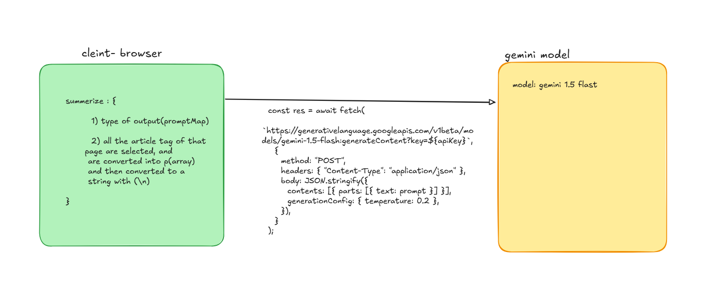
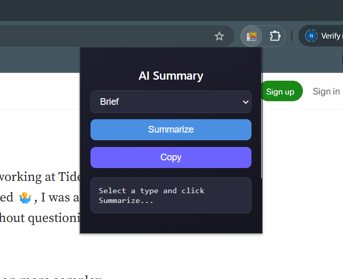
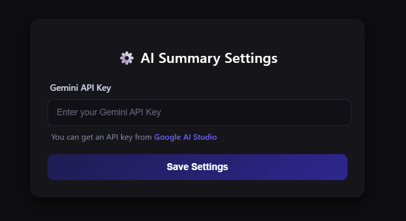

# 📝 AI Summary Extension

Summarize any webpage instantly with the power of **Gemini API**.  
Choose between **Brief**, **Bullet Points**, or **Detailed** summaries — all from a sleek dark-themed popup.

---

## 🚀 How it works

1. Get your **Gemini API key** from [Google AI Studio](https://makersuite.google.com/app/apikey).
2. Open the extension **Options** page and save your key.
3. Open any webpage → click the extension icon → select summary style → done!

---

## ✨ Features

- ⚡ Instant summaries in 3 modes
- 📋 One-click copy to clipboard
- 🎨 Dark modern UI with smooth animations
- 🌐 Works on **Chrome**, **Brave**, and other Chromium browsers

---

## 📸 Screenshots

structure of the Project:



PopUp UI:



ApiKey request:



---

## 📂 Installation (Developer Mode)

1. Clone or download this repository:
   ```bash
   git clone https://github.com/your-username/ai-summary-extension.git
   cd ai-summary-extension
   ```

